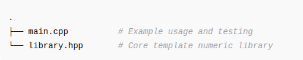

# 📘 Development of a Numeric Library in Modern C++

## 🧠 Project Objective

To design and implement a versatile numeric library utilizing the power of Modern C++ templates, demonstrating a solid understanding of:

- Template programming
- Arithmetic operations
- Operator overloading
- Type traits and compile-time safety

---

## 🚀 Core Features

### ✅ 1. **Numeric Operations**

The library provides several utility functions to operate on numeric data types:

- `max::mx(...)` – Returns the **maximum** value among its arguments.
- `min::mn(...)` – Returns the **minimum** value among its arguments.
- `sum::accumulate(...)` – Returns the **sum** of its arguments.
- `average::avg(...)` – Returns the **average** of its arguments.
- `fast_power::power(base, exp)` – Computes base raised to the power of exp using **fast exponentiation** (modulo 1e9+7).
- `factorial::fact(n)` – Returns the **factorial** of a number (modulo 1e9+7).
- `prime_number::seive(n)` – Uses the **Sieve of Eratosthenes** to check if a number is prime.

### ✅ 2. **Template Programming**

All core operations are implemented using variadic **C++ templates**, enabling support for multiple input types such as `int`, `float`, and `double`, while using **compile-time checks** to restrict to arithmetic types only.

### ✅ 3. **Arithmetic Data Type Enforcement**

By utilizing `std::is_arithmetic` and `std::common_type`, the library ensures only numeric data types are accepted unless explicitly specialized.

---


## 🎁 Bonus Feature: Custom Data Type Support

A custom behavior for subtraction is demonstrated through **template specialization** of the `subtraction<T>` class. While general arithmetic types (like `int`, `float`, etc.) use the default template, a custom implementation is defined for `std::string`.

### 📌 General Template for Arithmetic Types

```cpp
template <typename T>
class subtraction {
public:
    auto sub(const T& a, const T& b) {
        auto s = a - b;
        return s;
    }
};

## 🗃️ File Structure



## 🛠️ Requirements

- C++17 

## 📚 Concepts Demonstrated

- Template metaprogramming

- Variadic templates

- Type traits (std::is_arithmetic, std::common_type)

- Function overloading & specialization

- Modular arithmetic for overflow-safe operations

- Efficient algorithm implementation (Fast Exponentiation, Sieve of Eratosthenes)

## 📝 License

This project is for educational purposes. Feel free to fork and expand it.

